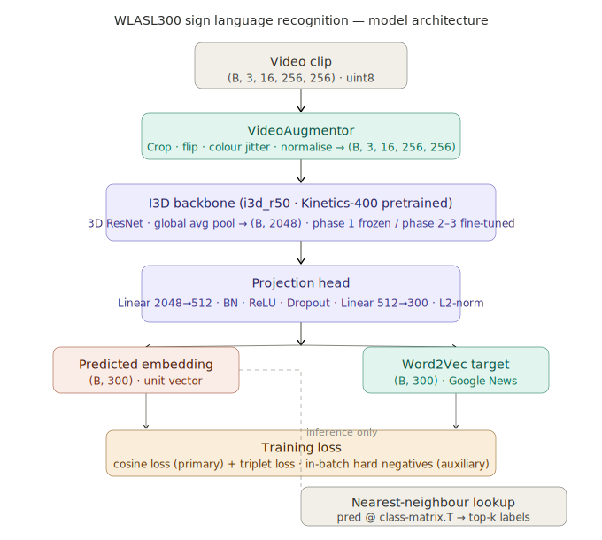

# WLASL300 Sign Language Recognition

A PyTorch codebase for recognising American Sign Language (ASL) words from video sequences using the [WLASL300 dataset](https://www.kaggle.com/datasets/vodinhnhattruong/dataset-wlasl300).

The model extracts spatio-temporal features with a pretrained **I3D backbone**, projects them into the same embedding space as **Word2Vec** word vectors, and is trained by minimising **cosine embedding loss** — no softmax classifier required.

---

## Table of contents

- [Architecture overview](#architecture-overview)
- [Requirements](#requirements)
- [Installation](#installation)
- [Dataset setup](#dataset-setup)
- [Project structure](#project-structure)
- [Configuration](#configuration)
- [Training](#training)
- [Inference](#inference)
- [Evaluation](#evaluation)
- [Running tests](#running-tests)
- [Experiment tracking](#experiment-tracking)
- [Notebooks](#notebooks)
- [Contributing](#contributing)

---

## Architecture overview

```
Video clip (B, 3, 64, 224, 224)
        │
        ▼
 I3D backbone (Kinetics-400 pretrained)
        │  global avg pool
        ▼
  Feature vector (B, 1024)
        │
        ▼
  Projection head
  Linear(1024→512) → BN → ReLU → Dropout
  Linear(512→300)  → L2 normalise
        │
        ▼
  Predicted embedding (B, 300)  ◄──── Cosine loss ────► Word2Vec target (B, 300)

```

### Models









At inference, the predicted embedding is compared against the precomputed class embedding matrix via nearest-neighbour lookup.

---

## Requirements

- Python 3.10+
- CUDA-capable GPU (≥ 16 GB VRAM recommended for batch size 8 with T=64 frames)
- [uv](https://github.com/astral-sh/uv) package manager

---

## Installation

```bash
# 1. Clone the repository
git clone https://github.com/jibran/wlasl300-sign-language.git
cd wlasl300-sign-language

# 2. Install uv (if not already installed)
curl -LsSf https://astral.sh/uv/install.sh | sh

# 3. Create virtual environment and install core dependencies
uv sync

# 4. Install video decoding extras (requires FFmpeg system libraries)
# Linux:
#   sudo apt-get install -y ffmpeg libavcodec-dev libavformat-dev libavutil-dev
# macOS:
#   brew install ffmpeg
uv sync --extra video

# 5. Install dev + test extras
uv sync --extra dev --extra test

# 6. Copy and fill in environment variables
cp .env.example .env
# Edit .env with your API keys and dataset paths

# 7. (Optional) Install pre-commit hooks
uv run pre-commit install
```

---

## Dataset setup

### Download from Kaggle

```bash
# Using the Kaggle CLI (credentials in .env)
uv run kaggle datasets download vodinhnhattruong/dataset-wlasl300 \
    --unzip --path data/raw/

# Also download the original WLASL JSON annotation file
# from https://github.com/dxli94/WLASL and place it at:
#   data/raw/WLASL_v0.3.json
```

### Build annotations

This step parses `WLASL_v0.3.json`, verifies video files on disk, computes Word2Vec embeddings for all 300 words, and produces stratified train/val/test splits.

```bash
uv run python dataset/annotations/build_annotations.py \
    --raw_dir           dataset/raw \
    --preprocessing_dir  preprocessing \
    --wlasl_dir          WLASL300 \
    --folder2label       folder2label_str.txt \
    --word2vec_bin       trained_models/embeddings/GoogleNews-vectors-negative300.bin \
    --out_dir            dataset/annotations
```

Outputs written to `dataset/annotations/`:

| File | Description |
|---|---|
| `annotations.json` | Per-video metadata: path, label, split, signer, bbox, frames |
| `vocab.json` | Ordered list of 300 class names (index = class ID) |
| `splits.json` | Train / val / test video ID assignments |
| `word2vec_embeddings.npy` | Shape `(300, 300)`, L2-normalised float32 |
| `oov_report.txt` | Out-of-vocabulary words and fallback strategy used |

---

## Project structure

```
wlasl300-sign-language/
├── pyproject.toml              # Project metadata and dependencies (uv)
├── .env.example                # Environment variable template
├── README.md
│
├── config/
│   ├── config.yaml             # All hyperparameters and paths
│   └── base_config.py          # Typed dataclass that loads config.yaml
│
├── dataset/
│   ├── raw/                    # Original Kaggle download (gitignored)
│   ├── processed/              # Preprocessed tensors (gitignored)
│   ├── features/               # Offline I3D feature cache (gitignored)
│   ├── annotations/
│   │   ├── build_annotations.py
│   │   ├── vocab.json          # Committed — small and stable
│   │   └── ...                 # Generated files (gitignored)
│   └── data/
│       └── wlasl_dataset.py    # WLASL300Dataset (torch.utils.data.Dataset)
│
├── models/
│   ├── i3d_backbone.py         # I3D feature extractor (nn.Module)
│   ├── projection_head.py      # Embedding projection head (nn.Module)
│   └── sign_model.py           # Full model composing backbone + head
│
├── utils/
│   ├── video_utils.py          # Frame decoding, sampling, normalisation
│   ├── embedding_utils.py      # Word2Vec loading, OOV handling, lookup
│   ├── augmentation.py         # Video augmentation transforms
│   ├── metrics.py              # Top-k accuracy, cosine similarity metrics
│   └── visualization.py        # Accuracy curves, speed plots, embedding scatter
│
├── train/
│   └── train.py                # Main training script
│
├── inference/
│   └── inference.py            # Load checkpoint and predict from video
│
├── tests/
│   ├── test_dataset.py
│   ├── test_models.py
│   ├── test_utils.py
│   └── test_annotation.py
│
├── notebooks/
│   └── training_colab.ipynb    # Google Colab training notebook
│
├── logs/                       # Training logs and coverage reports
│
└── trained_models/
    ├── best/                   # Best validation checkpoint
    └── latest/                 # Most recent checkpoint
```

---

## Configuration

All hyperparameters live in `config/config.yaml`. Override any value via CLI or by creating an experiment-specific YAML:

```yaml
# config/config.yaml (excerpt)
model:
  backbone: i3d_r50
  embedding_dim: 300
  projection_hidden_dim: 512
  dropout: 0.4

training:
  epochs: 60
  batch_size: 8
  learning_rate: 1e-3
  weight_decay: 1e-4
  grad_accumulation_steps: 2
```

---

## Training

```bash
# Standard training run
uv run python train/train.py --config config/config.yaml

# Override specific values
uv run python train/train.py \
    --config config/config.yaml \
    --training.batch_size 16 \
    --training.learning_rate 5e-4

# Resume from a checkpoint
uv run python train/train.py \
    --config config/config.yaml \
    --resume trained_models/latest/checkpoint.pt
```

Checkpoints are saved to:
- `trained_models/latest/checkpoint.pt` — after every epoch
- `trained_models/best/checkpoint.pt` — when validation top-1 accuracy improves

---

## Inference

```bash
# Predict the sign in a single video
uv run python inference/inference.py \
    --checkpoint trained_models/best/checkpoint.pt \
    --video path/to/video.mp4 \
    --top_k 5

# Batch inference on a directory
uv run python inference/inference.py \
    --checkpoint trained_models/best/checkpoint.pt \
    --video_dir path/to/videos/ \
    --output results.json
```

---

## Evaluation

Metrics reported during and after training:

| Metric | Description |
|---|---|
| Top-1 accuracy | Nearest-neighbour class = ground truth |
| Top-5 accuracy | Ground truth in 5 closest embeddings |
| Mean cosine similarity | Avg similarity between predicted and target embedding |
| Per-class accuracy | Breakdown by word — identifies hard classes |

Visualisations (saved to `logs/plots/`):
- Training and validation loss curves
- Top-1 / Top-5 accuracy over epochs
- Throughput (videos/sec) per epoch
- 2D t-SNE of predicted embedding space (coloured by class)

---

## Running tests

```bash
# Run all tests
uv run pytest

# Fast tests only (exclude slow/integration)
uv run pytest -m "not slow and not integration"

# With coverage report
uv run pytest --cov
```

---

## Experiment tracking

### Weights & Biases

```bash
# Set WANDB_API_KEY in .env, then:
uv run python train/train.py --config config/config.yaml --logger wandb
```

### MLflow

```bash
# Start the MLflow UI
uv run mlflow ui

# Train with MLflow logging
uv run python train/train.py --config config/config.yaml --logger mlflow
```

---

## Notebooks

`notebooks/training_colab.ipynb` is a self-contained Google Colab notebook that:
1. Installs dependencies via `pip` (uv is not available on Colab)
2. Mounts Google Drive for dataset access
3. Runs the full training pipeline end-to-end
4. Saves the best checkpoint back to Drive

---

## Contributing

1. Fork the repository and create a feature branch
2. Install dev dependencies: `uv sync --extra dev`
3. Run linting: `uv run ruff check . && uv run black --check .`
4. Run tests: `uv run pytest`
5. Open a pull request with a clear description

---

## References

### Papers

**Dataset**

[1] Li, D., Rodriguez, C., Yu, X., & Li, H. (2020).
**Word-level deep sign language recognition from video: A new large-scale dataset and methods comparison.**
*Proceedings of the IEEE/CVF Winter Conference on Applications of Computer Vision (WACV).*
https://arxiv.org/abs/1910.11006
— Introduces the WLASL dataset used in this project. The annotation file `WLASL_v0.3.json` is sourced from the accompanying GitHub release.

**Video feature extraction — I3D backbone**

[2] Carreira, J., & Zisserman, A. (2017).
**Quo Vadis, Action Recognition? A New Model and the Kinetics Dataset.**
*Proceedings of the IEEE Conference on Computer Vision and Pattern Recognition (CVPR).*
https://arxiv.org/abs/1705.07750
— Proposes Inflated 3D Convolutions (I3D), the backbone architecture used to extract spatiotemporal features from sign language video clips. Pretrained weights from Kinetics-400 are used as the starting point for all three training phases.

**Word embeddings**

[3] Mikolov, T., Sutskever, I., Chen, K., Corrado, G., & Dean, J. (2013).
**Distributed Representations of Words and Phrases and their Compositionality.**
*Advances in Neural Information Processing Systems (NeurIPS).*
https://arxiv.org/abs/1310.4546
— Introduces Word2Vec skip-gram with negative sampling. The Google News 300-dimensional vectors (`GoogleNews-vectors-negative300.bin`) are used as fixed embedding targets during training.

**Metric learning — triplet loss**

[4] Schroff, F., Kalenichenko, D., & Philbin, J. (2015).
**FaceNet: A Unified Embedding for Face Recognition and Clustering.**
*Proceedings of the IEEE Conference on Computer Vision and Pattern Recognition (CVPR).*
https://arxiv.org/abs/1503.03832
— Introduces the triplet loss formulation used as an auxiliary objective alongside cosine embedding loss. The in-batch hard negative mining strategy in `SignModel._inbatch_triplet_loss` is directly motivated by this work.

**Optimiser**

[5] Loshchilov, I., & Hutter, F. (2019).
**Decoupled Weight Decay Regularization.**
*International Conference on Learning Representations (ICLR).*
https://arxiv.org/abs/1711.05101
— Proposes AdamW, the optimiser used throughout training. Decoupling weight decay from the gradient update is important for regularising the projection head on the small WLASL300 dataset.

**Learning rate schedule**

[6] Loshchilov, I., & Hutter, F. (2017).
**SGDR: Stochastic Gradient Descent with Warm Restarts.**
*International Conference on Learning Representations (ICLR).*
https://arxiv.org/abs/1608.03983
— Proposes cosine annealing with warm restarts, implemented via `CosineAnnealingWarmRestarts` in the training loop.

**Mixed-precision training**

[7] Micikevicius, P., Narang, S., Alben, J., Diamos, G., Elsen, E., Garcia, D., ... & Wu, H. (2018).
**Mixed Precision Training.**
*International Conference on Learning Representations (ICLR).*
https://arxiv.org/abs/1710.03740
— Motivates the use of `torch.cuda.amp` automatic mixed precision (`GradScaler` + `autocast`) to halve GPU memory usage during I3D training.

**Embedding-based visual-semantic recognition**

[8] Frome, A., Corrado, G. S., Shlens, J., Bengio, S., Dean, J., Ranzato, M., & Mikolov, T. (2013).
**DeViSE: A Deep Visual-Semantic Embedding Model.**
*Advances in Neural Information Processing Systems (NeurIPS).*
https://arxiv.org/abs/1301.3666
— The core training paradigm of this project — projecting visual features into a pre-trained word embedding space and training with cosine similarity as the objective — is directly inspired by the DeViSE framework.

---

### Code and libraries

**Deep learning framework**

[9] Paszke, A., Gross, S., Massa, F., Lerer, A., Bradbury, J., Chanan, G., ... & Chintala, S. (2019).
**PyTorch: An Imperative Style, High-Performance Deep Learning Library.**
*Advances in Neural Information Processing Systems (NeurIPS).*
https://arxiv.org/abs/1912.01703
— Core framework used for all model definition, training, and inference.

[10] **pytorchvideo** — Facebook AI Research (2021).
Video understanding library used to load pretrained I3D, SlowFast, and X3D backbones from Kinetics-400.
https://github.com/facebookresearch/pytorchvideo

[11] **torchvision** — PyTorch team.
Provides video transforms and spatial augmentation primitives (`ColorJitter`, `RandomCrop`, `CenterCrop`) used in `VideoAugmentor`.
https://github.com/pytorch/vision

**Video decoding**

[12] **decord** — Zheng, T. (2020).
Efficient video reader used for fast random-access frame decoding in `_decode_video_decord`.
https://github.com/dmlc/decord

**Word embeddings**

[13] Řehůřek, R., & Sojka, P. (2010).
**Software Framework for Topic Modelling with Large Corpora.**
*Proceedings of the LREC 2010 Workshop on New Challenges for NLP Frameworks.*
https://radimrehurek.com/gensim/
— gensim is used in `build_annotations.py` to load the Google News Word2Vec binary and compute per-class embedding vectors.

**Dataset**

[14] **WLASL300 on Kaggle** — Vo Dinh Nhat Truong (2022).
Kaggle mirror of the WLASL dataset used for download and video distribution.
https://www.kaggle.com/datasets/vodinhnhattruong/dataset-wlasl300

[15] **WLASL GitHub repository** — Li, D. et al.
Source of `WLASL_v0.3.json`, the official annotation file containing per-video signer ID, bounding box, frame boundaries, and original split assignments.
https://github.com/dxli94/WLASL

**Machine learning utilities**

[16] Pedregosa, F., Varoquaux, G., Gramfort, A., Michel, V., Thirion, B., Grisel, O., ... & Duchesnay, E. (2011).
**Scikit-learn: Machine Learning in Python.**
*Journal of Machine Learning Research, 12,* 2825–2830.
https://scikit-learn.org
— Used for `StratifiedShuffleSplit` in `build_annotations.py` to produce reproducible stratified train/val/test splits.

**Experiment tracking**

[17] **Weights & Biases** — Biewald, L. (2020).
Experiment Tracking with Weights and Biases.
https://wandb.ai
— Optional experiment tracker supported via `--logger wandb`.

[18] **MLflow** — Zaharia, M., Chen, A., Davidson, A., Ghodsi, A., Hong, S. A., Konwinski, A., ... & Talwalkar, A. (2018).
**Accelerating the Machine Learning Lifecycle with MLflow.**
*IEEE Data Engineering Bulletin.*
https://mlflow.org
— Optional experiment tracker supported via `--logger mlflow`.

**Visualisation**

[19] Hunter, J. D. (2007).
**Matplotlib: A 2D Graphics Environment.**
*Computing in Science & Engineering, 9*(3), 90–95.
https://matplotlib.org
— Used in `utils/visualization.py` for all training diagnostic plots (loss curves, accuracy curves, throughput, per-class bar charts, cosine similarity distribution).

[20] van der Maaten, L., & Hinton, G. (2008).
**Visualizing Data using t-SNE.**
*Journal of Machine Learning Research, 9,* 2579–2605.
https://jmlr.org/papers/v9/vandermaaten08a.html
— Used in `plot_embedding_scatter` via `sklearn.manifold.TSNE` to reduce predicted embeddings to 2D for qualitative inspection of class cluster separation.

**Package management**

[21] **uv** — Astral (2024).
Extremely fast Python package and project manager used for dependency resolution and virtual environment management.
https://github.com/astral-sh/uv

---

## License

MIT
